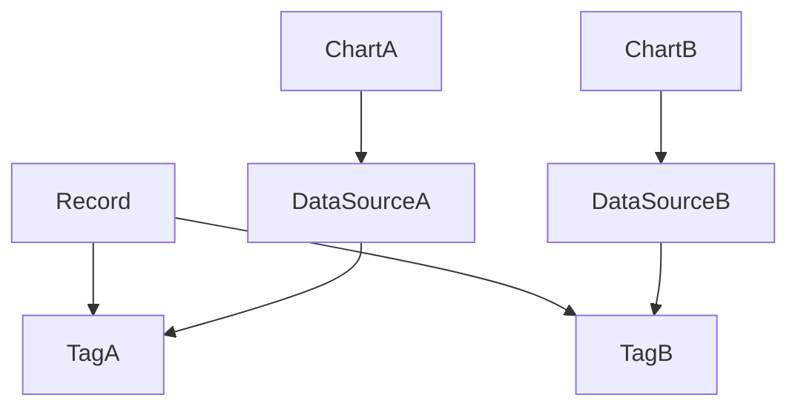

# ユーザーストーリーマッピング

## ゴール
- ユーザーが自分の好きな数値データ（例：読書ページ数、観た映画本数、筋トレ継続日数、ウェイト推移、ゴルフのスコアなど）を自由に記録、管理、可視化、分析できるようにする

## アクティビティ（大まかな流れや主要な行動）
- ハッシュタグを管理する
  - タグを作成することができる
  - タグを編集することができる
  - タグを削除することができる
- データソースを管理する
  - データソースを作成することができる
  - データソースを編集することができる
  - データソースを削除することができる
- 数値データを計測、入力する
　- 記録対象のタグを１つ以上選択することができる
  - 数値を計測、入力することができる
- 数値データを記録する
  - 日付やメモとともに数値を記録できる
- データを可視化する
  - １つのデータソースから複数のグラフを作成することができる
  - グラフや統計で推移・合計・平均などを可視化できる
  - 可視化のための表示設定や期間指定ができる

## 詳細ストーリー・タスク
| アクティビティ                 | ユーザーストーリー                                               | タスク                              | 優先度 | 備考 |
|:------------------------------|:----------------------------------------------------------------|:-------------------------------------|:------|:-----|
| ハッシュタグを管理する         | ユーザーはタグを作成することができる                            | タグ作成UIの実装                     | 高    |      |
| ハッシュタグを管理する         | ユーザーはタグを編集することができる                            | タグ編集UIの実装                     | 高    |      |
| ハッシュタグを管理する         | ユーザーはタグを削除することができる                            | タグ削除機能の実装                   | 高    |      |
| データソースを管理する         | ユーザーはデータソースを作成することができる                    | データソース作成UIの実装             | 高    |      |
| データソースを管理する         | ユーザーはデータソースを編集することができる                    | データソース編集UIの実装             | 高    |      |
| データソースを管理する         | ユーザーはデータソースを削除することができる                    | データソース削除機能の実装           | 高    |      |
| 数値データを計測、入力する     | ユーザーは記録対象のタグを１つ以上選択することができる           | タグ選択UIの実装                     | 高    |      |
| 数値データを計測、入力する     | ユーザーは数値を計測、入力することができる                      | 数値入力UIの実装                     | 高    |      |
| 数値データを記録する           | ユーザーは日付やメモとともに数値を記録できる                    | 記録入力フォームの作成               | 高    |      |
| データを可視化する             | ユーザーは１つのデータソースから複数のグラフを作成することができる| グラフ作成UIの実装                   | 中    |      |
| データを可視化する             | ユーザーはグラフや統計で推移・合計・平均などを可視化できる       | グラフ・統計表示機能の実装           | 中    |      |
| データを可視化する             | ユーザーは可視化のための表示設定や期間指定ができる              | 表示設定UI・期間指定機能の実装        | 中    |      |
| データを編集・削除する        | ユーザーは記録済みデータやハッシュタグを編集できる            | 編集画面の作成                     | 中    |      |
| データを編集・削除する        | ユーザーは記録済みデータを削除できる                       | 削除機能の実装                      | 中    |      |

## リリース計画
- 第1リリース：ハッシュタグ管理、数値データ記録、履歴一覧表示、削除機能
- 第2リリース：編集機能、グラフ・統計による可視化、可視化設定

---

