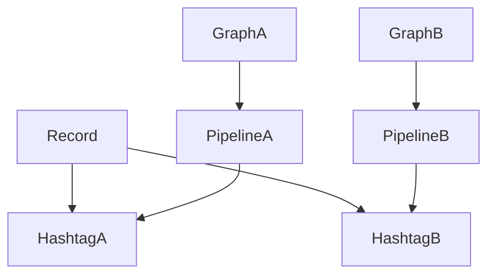

# ユーザーストーリーマッピング

## ゴール
- ユーザーが自分の好きなデータ（例：読書ページ数、観た映画本数、筋トレ継続日数、ウェイト推移、ゴルフのスコアなど）を自由に記録、管理、グラフ化、分析できるようにする

## アクティビティ（大まかな流れや主要な行動）
- ハッシュタグを管理できる
  - ハッシュタグを作成することができる
  - ハッシュタグを編集することができる
  - ハッシュタグを削除することができる
- パイプラインを管理できる
  - パイプラインを作成することができる
  - パイプラインを編集することができる
  - パイプラインを削除することができる
- データを計測、入力、保存できる
  - 記録対象のハッシュタグを１つ以上選択することができる
  - 選択したハッシュタグに応じた入力フィールドが表示される
  - データを計測、入力することができる
  - 日付やメモを入力することができる
  - データを保存することができる
- グラフを作成・表示できる
  - １つのパイプラインから複数のグラフを作成することができる
  - グラフや統計で推移・合計・平均などを可視化できる
  - グラフの表示設定ができる

## 詳細ストーリー・タスク

全体像のため割愛

