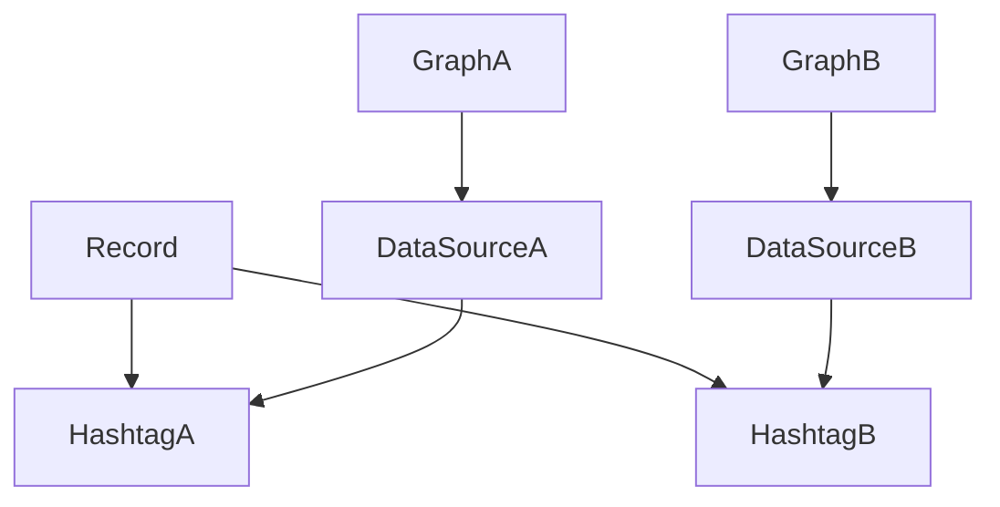

# ユーザーストーリーマッピング

## ゴール
- ユーザーが自分の好きなデータ（例：読書ページ数、観た映画本数、筋トレ継続日数、ウェイト推移、ゴルフのスコアなど）を自由に記録、管理、グラフ化、分析できるようにする

## アクティビティ（大まかな流れや主要な行動）
- ハッシュタグを管理できる
  - ハッシュタグを作成することができる
  - ハッシュタグを編集することができる
  - ハッシュタグを削除することができる
- データソースを管理できる
  - データソースを作成することができる
  - データソースを編集することができる
  - データソースを削除することができる
- データを計測、入力、保存できる
  - 記録対象のハッシュタグを１つ以上選択することができる
  - 選択したハッシュタグに応じた入力フィールドが表示される
  - データを計測、入力することができる
  - 日付やメモを入力することができる
  - データを保存することができる
- グラフを作成・表示できる
  - １つのデータソースから複数のグラフを作成することができる
  - グラフや統計で推移・合計・平均などを可視化できる
  - グラフの表示設定や期間指定ができる

## 詳細ストーリー・タスク
| アクティビティ                     | ユーザーストーリー                                               | タスク                              | 優先度 | 備考 |
|:----------------------------------|:----------------------------------------------------------------|:-------------------------------------|:------|:-----|
| ハッシュタグを管理できる             | ユーザーはハッシュタグを作成することができる                    | ハッシュタグ作成UIの実装             | 高    |      |
| ハッシュタグを管理できる             | ユーザーはハッシュタグを編集することができる                    | ハッシュタグ編集UIの実装             | 高    |      |
| ハッシュタグを管理できる             | ユーザーはハッシュタグを削除することができる                    | ハッシュタグ削除機能の実装           | 高    |      |
| データソースを管理できる             | ユーザーはデータソースを作成することができる                    | データソース作成UIの実装             | 高    |      |
| データソースを管理できる             | ユーザーはデータソースを編集することができる                    | データソース編集UIの実装             | 高    |      |
| データソースを管理できる             | ユーザーはデータソースを削除することができる                    | データソース削除機能の実装           | 高    |      |
| データを計測、入力、保存できる       | ユーザーは記録対象のハッシュタグを１つ以上選択することができる   | ハッシュタグ選択UIの実装             | 高    |      |
| データを計測、入力、保存できる       | ユーザーは選択したハッシュタグに応じた入力フィールドを確認できる | 入力フィールド動的生成の実装         | 高    |      |
| データを計測、入力、保存できる       | ユーザーはデータを計測、入力することができる                    | データ入力UIの実装                   | 高    |      |
| データを計測、入力、保存できる       | ユーザーは日付やメモを入力できる                                | 日付・メモ入力UIの実装               | 高    |      |
| データを計測、入力、保存できる       | ユーザーは入力内容を記録として保存できる                        | 入力内容保存機能の実装               | 高    |      |
| グラフを作成・表示できる             | ユーザーは１つのデータソースから複数のグラフを作成することができる| グラフ作成UIの実装                   | 中    |      |
| グラフを作成・表示できる             | ユーザーはグラフや統計で推移・合計・平均などを可視化できる      | グラフ・統計表示機能の実装           | 中    |      |
| グラフを作成・表示できる             | ユーザーはグラフの表示設定や期間指定ができる                    | グラフ表示設定UIの実装               | 中    |      |

