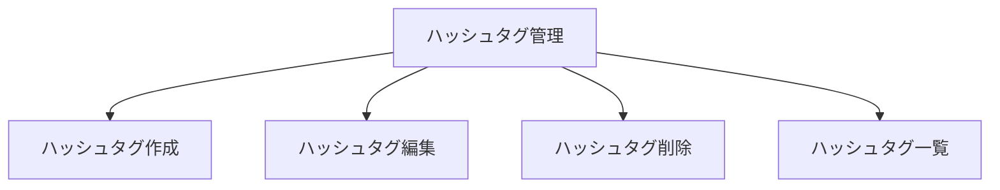

# ハッシュタグを管理できる（ユーザーストーリーマッピング）

## ゴール
- ユーザーは記録をパイプラインに紐づけるためのハッシュタグを柔軟に管理できる

## アクティビティ
- ハッシュタグ一覧を表示する
  - ユーザーはすべての登録済みハッシュタグをリスト形式で一目で確認できる
  - 各ハッシュタグごとに編集・削除ボタンがあり、操作できる
  - ハッシュタグの並び順（作成順、名前順、カスタム順など）を切り替えて見やすくできる
- ハッシュタグを新規作成する
  - 「新規作成」ボタンからハッシュタグ追加画面を開ける
  - ハッシュタグ名を入力し、空欄や重複、文字数オーバーの場合はエラーが表示される
  - ハッシュタグに紐づけるデータ形式（型）を指定できる（例：「勉強時間」なら時間型を選択）
  - 作成したハッシュタグは一覧で確認できる
- ハッシュタグを編集する
  - 編集ボタンから、既存のハッシュタグ名や紐づけるデータ形式（型）を修正できる
  - 編集内容は保存後一覧に反映される
- ハッシュタグを削除する
  - 削除ボタンから、不要なハッシュタグを削除できる
  - 削除時は確認ダイアログが表示され、誤操作を防げる
  - 利用中のハッシュタグを削除しようとした場合は警告が表示される

## ユーザーストーリーとタスク
| アクティビティ         | ユーザーストーリー                                                                 | タスク例                                  | 優先度 |
|:----------------------|:----------------------------------------------------------------------------------|:------------------------------------------|:------|
| ハッシュタグを作成する | ユーザーは新しいハッシュタグを作成できる                                           | ・ハッシュタグ名を入力するUIを表示する     | 高    |
|                       |                                                                                  | ・ハッシュタグ名のバリデーションを行う     | 高    |
|                       |                                                                                  | ・作成ボタンでハッシュタグを追加           | 高    |
| ハッシュタグを編集する | ユーザーは既存のハッシュタグ名を編集できる                                         | ・ハッシュタグ編集UIを表示する             | 高    |
|                       |                                                                                  | ・編集内容を保存する                       | 高    |
| ハッシュタグを削除する | ユーザーは不要なハッシュタグを削除できる                                           | ・削除ボタンを表示する                     | 高    |
|                       |                                                                                  | ・削除確認ダイアログを表示する              | 高    |
|                       |                                                                                  | ・ハッシュタグを削除する                   | 高    |
| ハッシュタグを一覧で確認する | ユーザーは登録済みのハッシュタグを一覧で確認できる                         | ・ハッシュタグ一覧を表示する               | 高    |

## マッピング図（例）

## 備考
- ハッシュタグは記録やグラフ機能と連携予定
- ハッシュタグの色や並び順などは今後検討
