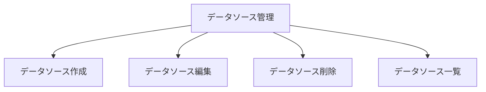

# データソースを管理できる（ユーザーストーリーマッピング）

## ゴール
- ユーザーは「自分にとって意味のある数値データ」を、目的や使い方に合わせて自由に管理できる
- 記録や可視化をより自分らしくカスタマイズできる

## アクティビティ
- データソース一覧を確認する
  - ユーザーは自分が管理しているデータソースを一目で把握できる
  - どんなデータを記録しているか、用途や単位もすぐ分かる
  - 編集・削除などの操作も直感的に行える
- データソースを新しく作る
  - 「自分だけの記録項目」を自由に追加できる
  - 例：読書ページ数、体重、ランニング距離、勉強時間など
  - １つのハッシュタグを選択できる
  - 名前や単位、説明を入力し、分かりやすく管理できる
  - 入力ミスや重複も分かりやすくエラー表示される
- データソースを編集する
  - 使い方が変わったとき、いつでも内容を修正できる
  - 編集内容はすぐに一覧や記録画面に反映される
- データソースを削除する
  - 使わなくなったデータソースは簡単に削除できる
  - 間違って消さないように確認ダイアログや警告が表示される

## ユーザーストーリーとタスク
| アクティビティ               | ユーザーストーリー                                             | タスク例                              | 優先度 |
|:----------------------------|:--------------------------------------------------------------|:--------------------------------------|:------|
| データソース一覧を確認する   | ユーザーは自分が管理しているデータソースを一覧で把握できる     | ・データソース一覧表示UIの実装         | 高    |
|                             | ユーザーは各データソースの用途や単位を確認できる               | ・用途・単位表示機能の実装             | 高    |
|                             | ユーザーは編集・削除操作を直感的に行える                       | ・編集・削除ボタンUIの実装             | 高    |
| データソースを新しく作る     | ユーザーは新しい記録項目を追加できる                           | ・新規作成ボタンから入力画面を開く      | 高    |
|                             | ユーザーは1つのハッシュタグを選択できる                        | ・ハッシュタグ選択UIの実装             | 高    |
|                             | ユーザーは名前・単位・説明を入力できる                         | ・入力フォームUIの実装                 | 高    |
|                             | ユーザーは入力ミスや重複時にエラーを確認できる                 | ・バリデーション・エラー表示の実装     | 高    |
| データソースを編集する       | ユーザーは既存のデータソース内容を修正できる                   | ・編集ボタンから編集画面を開く          | 高    |
|                             | 編集内容はすぐに一覧や記録画面に反映される                     | ・編集内容保存・即時反映の実装         | 高    |
| データソースを削除する       | ユーザーは不要なデータソースを安全に削除できる                 | ・削除ボタンUIの実装                   | 高    |
|                             | 削除前に確認ダイアログや警告が表示される                       | ・確認ダイアログ・警告表示の実装       | 高    |

## マッピング図（例）

## 備考
- データソースは記録やグラフ機能と連携予定
- ユーザーが「自分らしい記録・可視化」を実現できるよう、柔軟性と分かりやすさを重視
- データソースの型や単位、色分けなどは今後検討
