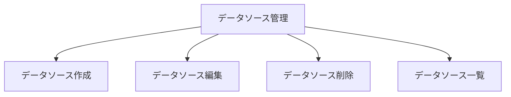

# データソースを管理できる（ユーザーストーリーマッピング）

## ゴール
- ユーザーは「自分にとって意味のある数値データ」を、目的や使い方に合わせて自由に管理できる
- 記録や可視化をより自分らしくカスタマイズできる

## アクティビティ
- データソース一覧を確認する
  - ユーザーは自分が管理しているデータソースを一目で把握できる
  - どんなデータを記録しているか、用途や単位もすぐ分かる
  - 編集・削除などの操作も直感的に行える
- データソースを新しく作る
  - 「自分だけの記録項目」を自由に追加できる
  - 例：読書ページ数、体重、ランニング距離、勉強時間など
  - 名前や単位、説明を入力し、分かりやすく管理できる
  - 入力ミスや重複も分かりやすくエラー表示される
- データソースを編集する
  - 使い方が変わったとき、いつでも内容を修正できる
  - 編集内容はすぐに一覧や記録画面に反映される
- データソースを削除する
  - 使わなくなったデータソースは簡単に削除できる
  - 間違って消さないように確認ダイアログや警告が表示される

## ユーザーストーリーとタスク
| アクティビティ         | ユーザーストーリー                                                                 | タスク例                                  | 優先度 |
|:----------------------|:----------------------------------------------------------------------------------|:------------------------------------------|:------|
| データソースを作成する | ユーザーは「自分だけの記録項目」を追加したい                                      | ・新規作成ボタンから入力画面を開く         | 高    |
|                       |                                                                                  | ・名前・単位・説明を入力する               | 高    |
|                       |                                                                                  | ・分かりやすいエラー表示                   | 高    |
| データソースを編集する | ユーザーは「記録項目の内容や用途」を後から変更したい                              | ・編集ボタンから編集画面を開く             | 高    |
|                       |                                                                                  | ・編集内容を保存し、すぐ反映               | 高    |
| データソースを削除する | ユーザーは「不要になった記録項目」を安全に削除したい                              | ・削除ボタンを表示する                     | 高    |
|                       |                                                                                  | ・削除前に確認ダイアログや警告を表示        | 高    |
|                       |                                                                                  | ・データソースを削除する                   | 高    |
| データソースを一覧で確認する | ユーザーは「自分が管理している記録項目」をすぐに把握したい                  | ・データソース一覧を分かりやすく表示       | 高    |

## マッピング図（例）

## 備考
- データソースは記録やグラフ機能と連携予定
- ユーザーが「自分らしい記録・可視化」を実現できるよう、柔軟性と分かりやすさを重視
- データソースの型や単位、色分けなどは今後検討
