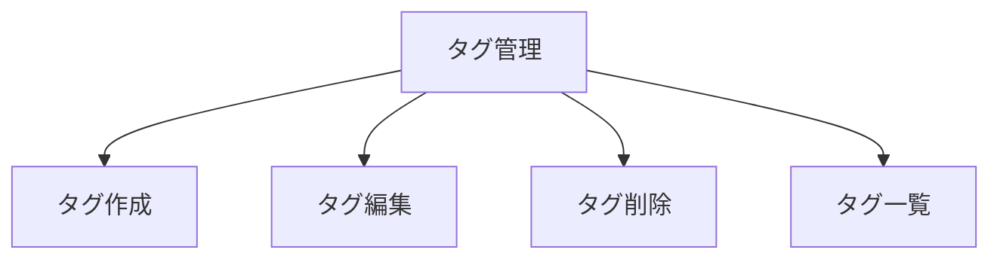

# ハッシュタグを管理できる（ユーザーストーリーマッピング）

## ゴール
- ユーザーは記録をデータソースに紐づけるためのハッシュタグを柔軟に管理できる

## アクティビティ
- タグ一覧を表示する
  - ユーザーはすべての登録済みタグをリスト形式で一目で確認できる
  - 各タグごとに編集・削除ボタンがあり、操作できる
  - タグの並び順（作成順、名前順、カスタム順など）を切り替えて見やすくできる
- タグを新規作成する
  - 「新規作成」ボタンからタグ追加画面を開ける
  - タグ名を入力し、空欄や重複、文字数オーバーの場合はエラーが表示される
  - タグに紐づけるデータ形式（型）を指定できる（例：「勉強時間」なら時間型を選択）
  - 作成したタグは一覧で確認できる
- タグを編集する
  - 編集ボタンから、既存のタグ名や紐づけるデータ形式（型）を修正できる
  - 編集内容は保存後一覧に反映される
- タグを削除する
  - 削除ボタンから、不要なタグを削除できる
  - 削除時は確認ダイアログが表示され、誤操作を防げる
  - 利用中のタグを削除しようとした場合は警告が表示される

## ユーザーストーリーとタスク
| アクティビティ         | ユーザーストーリー                                                                 | タスク例                                  | 優先度 |
|:----------------------|:----------------------------------------------------------------------------------|:------------------------------------------|:------|
| タグを作成する         | ユーザーは新しいタグを作成できる                                                   | ・タグ名を入力するUIを表示する             | 高    |
|                       |                                                                                  | ・タグ名のバリデーションを行う             | 高    |
|                       |                                                                                  | ・作成ボタンでタグを追加                   | 高    |
| タグを編集する         | ユーザーは既存のタグ名を編集できる                                                 | ・タグ編集UIを表示する                     | 高    |
|                       |                                                                                  | ・編集内容を保存する                       | 高    |
| タグを削除する         | ユーザーは不要なタグを削除できる                                                   | ・削除ボタンを表示する                     | 高    |
|                       |                                                                                  | ・削除確認ダイアログを表示する              | 高    |
|                       |                                                                                  | ・タグを削除する                           | 高    |
| タグを一覧で確認する   | ユーザーは登録済みのタグを一覧で確認できる                                         | ・タグ一覧を表示する                       | 高    |

## マッピング図（例）

## 備考
- タグは記録やグラフ機能と連携予定
- タグの色や並び順などは今後検討
